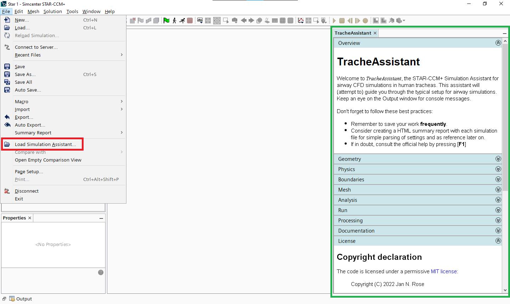

# TracheAssistant

STAR-CCM+ Simulation Assistant for airway CFD simulations in human tracheas.

## What is this?

From the STAR-CCM+ user guide:
> A Simulation Assistant provides a visual workflow within the Simcenter STAR-CCM+ user interface (UI).

## Getting started

I am using Apache NetBeans IDE 12.6 for development. The [nbproject](./nbproject/) directory in this repository contains all configuration files such that the project can be loaded and built (almost) right away.

A recent JDK needs to be installed. I am using OpenJDK 17.0.2. The project is configured to build with JDK 11 compatibility (required for STAR-CCM+).

Within NetBeans, the STAR-CCM+ development class and javadoc paths need to be configured. The setup assumes the library name `STAR-CCM+ 2021.2.1 (16.04.012) - JDK`. This can be changed inside [nbproject/project.properties](./nbproject/project.properties) by editing the `javac.classpath` variable.

## Loading the simulation assistant

In an active STAR-CCM+ session, click on `File > Load Simulation Assistant...` (red) and `Open` the file `TracheAssistant.jar`, located in the `dist` directory. This places the simulation assistant on the right of the window (green).
